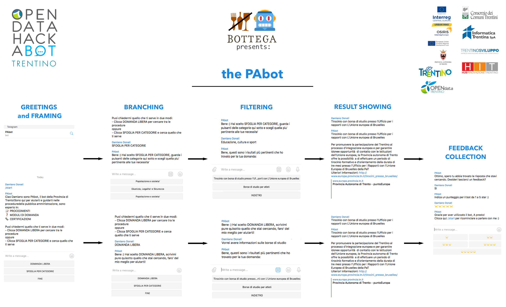

## damdo/hackabot-bottega-pabot

:robot: **Telegram Bot winner** of the **Open Data Hackabot 2018** (hackathon)
developed for the *Provincia Autonoma di Trento (PaT)* by me and my team, the BOTtega. https://www.odhb2018.net/

<br>



### CREDITS:
BOTtega team:
- Damiano Donati https://github.com/damdo
- Nicola Garau https://github.com/a7ocin
- Ivan Kayongo https://github.com/benhurIvo
- Andrea Zanella

### SPONSOR AND MENTORS:
Thanks also to our mentors, sponsors and committee:
- Nicola Cracchi Bianchi, Piergiorgio Cipriano and Giulia Degli Esposti from [Dedagroup](https://www.dedagroup.it)
- Carlo Caprini from [U-Hopper](https://u-hopper.com) for the precious help
- The girls and guys at [Provincia Autonoma di Trento](http://www.provincia.tn.it), [Open Data Trentino](https://dati.trentino.it) and [Informatica Trentina](https://www.infotn.it): Cristiana, Francesca, Antonella, Marco, Alessandro, Mirko, Nicola, Federico, and all the others involved in the organization of this inspiring event 


<hr><hr>

### USAGE:
Pre-requisites and running steps

#### PRE-REQUISITES:
- docker-ce up and running
- **IMPORTANT**: to run the bot container properly you must link it to a backend container that exposes data for it in JSON. (we already have a custom backend designed for specific testing purposes, contact us  if you need it)


#### RUN:
```sh
# run your backend-service container (not included in this repo)
docker build -t hackabot-bottega-backend-service .
docker run --rm -it --name hackabot-bottega-backend-service hackabot-bottega-backend-service

# run the bot container
docker build -t hackabot-bottega-pabot .
docker run --rm -it -e BOT_TOKEN=<your-telegram-bot-api-key> --link hackabot-bottega-backend-service:hackabot-bottega-backend-service --name hackabot-bottega-pabot hackabot-bottega-pabot
```

This project uses third party libraries that are distributed under their own terms (See 3RD-PARTY file)
It internally uses:
- the python-telegram-bot library: https://github.com/python-telegram-bot/python-telegram-bot
- the requests library: https://github.com/requests/requests

